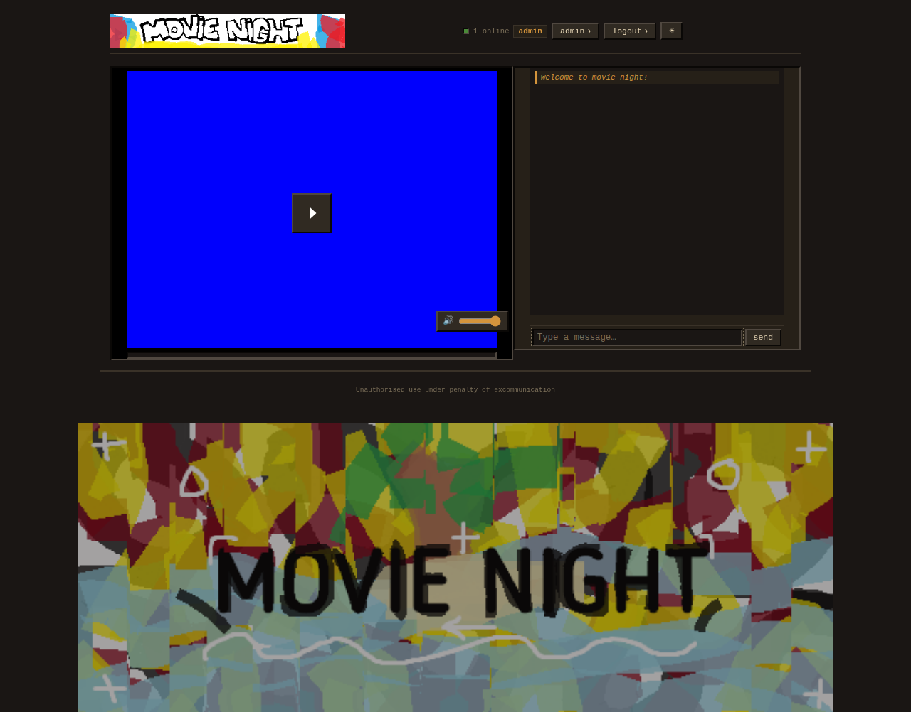
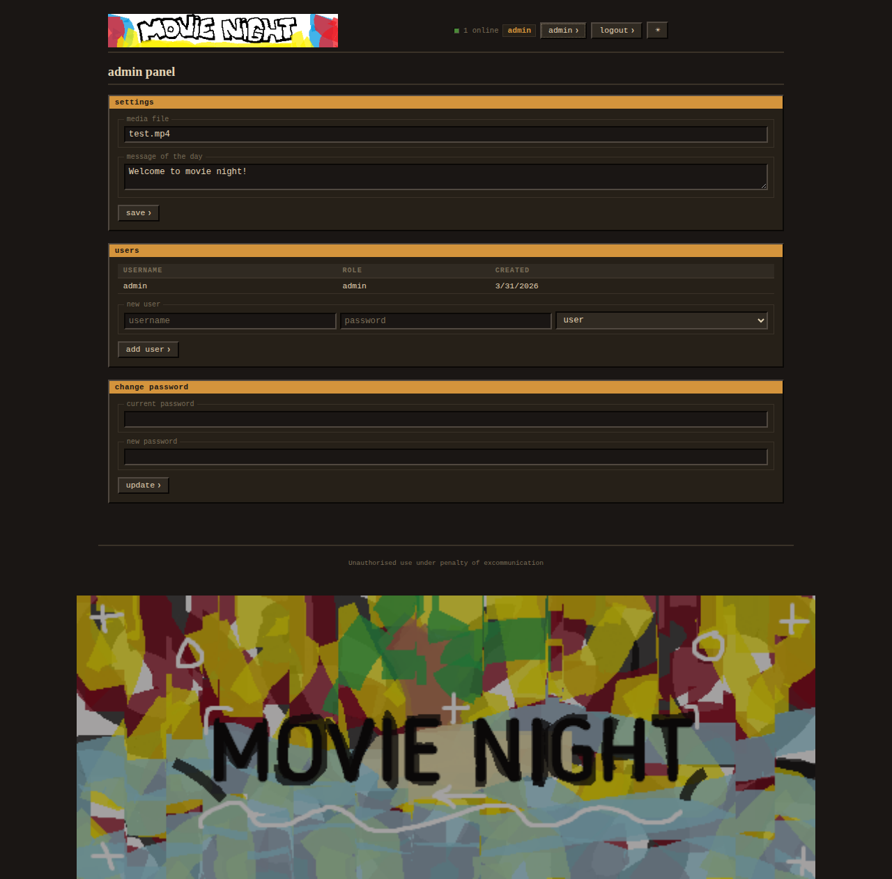
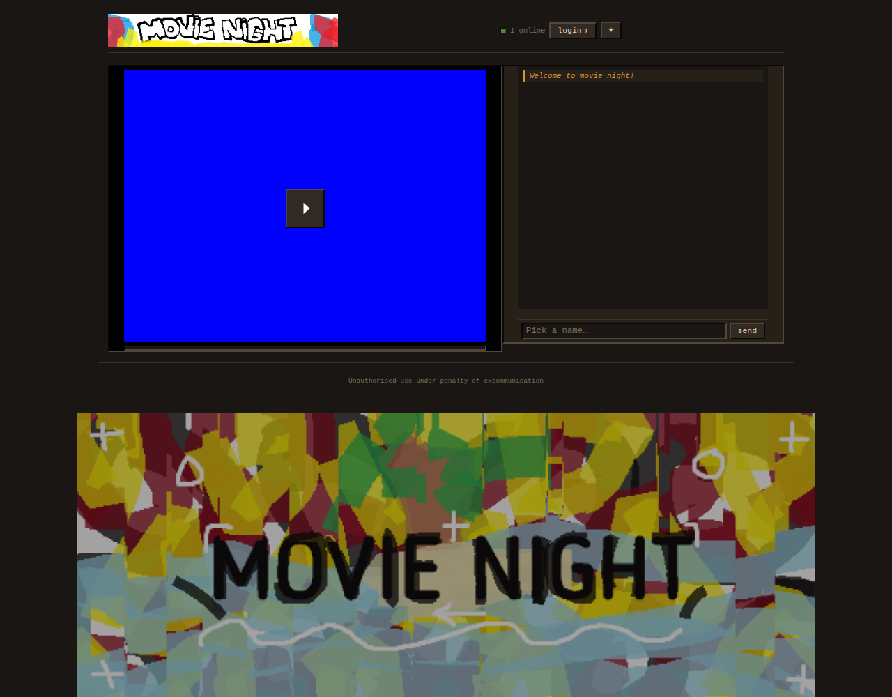
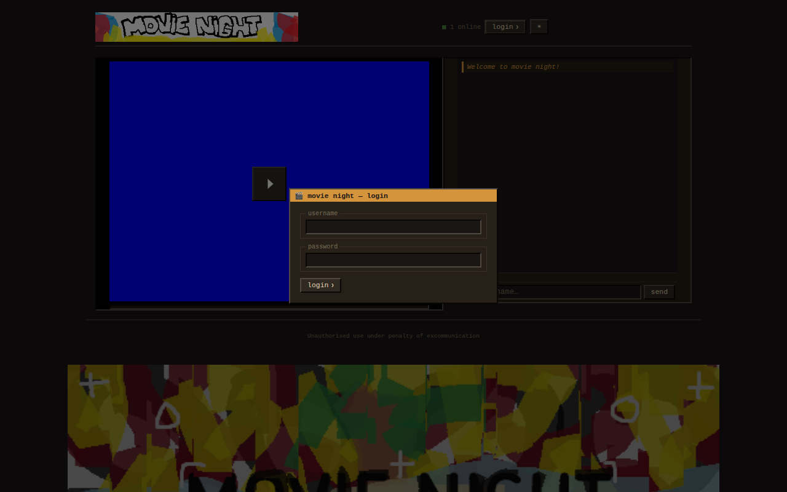

# mn

**self-hosted synchronized movie night — video stream + chat + auth, single `node server.mjs`**

> akin to [cytube](https://cytu.be) or [rabb.it](https://rabb.it) &nbsp;·&nbsp; 🔎 pull requests welcome

---

## screenshots

### viewer (normal user)



### admin panel



<details>
<summary>more screenshots</summary>

**Landing page (not logged in)**



**Login modal**



</details>

---

## features

**video**
- 🎬 **Synced playback** – admin controls play/pause and seek for all viewers in real time
- 🔊 **Volume & mute** – per-viewer slider + mute button (hover over video, or press `M`)
- ⏩ **Progress bar** – click to seek (admin only); shows current time / duration

**chat**
- 💬 **Live chat** – WebSocket, same port as HTTP, no extra infrastructure needed
- 📜 **Chat history** – last 50 messages delivered to new joiners instantly (pre-serialized, zero JSON cost)
- 🔔 **Typing indicators** – see who's composing in real time
- 💌 **P2P direct messages** – WebRTC data channels; the server only relays SDP/ICE, the chat payload never touches the server

**auth & security**
- 🔐 **Authentication** – `scrypt`-hashed passwords, SQLite-backed, session cookies
- 🛡️ **Rate limiting** – continuous token-bucket per policy (AUTH / READ / WRITE / STREAM / STATIC) keyed by IP
- 🔒 **Content Security Policy** – strict CSP header, `frame-ancestors 'none'`
- 🌐 **WebSocket origin validation** – blocks cross-site WebSocket hijacking
- 🚦 **Connection caps** – global max WS connections + per-IP connection limit

**keyboard shortcuts** (click the video first to focus)

| Key | Action |
|-----|--------|
| `Space` | Play / pause (admin broadcasts to all viewers) |
| `F` | Fullscreen |
| `M` | Mute / unmute |
| `←` / `→` | ±5 s seek *(admin only)* |
| `Esc` | Close modal / DM panel |

**deployment**
- 🐳 **Docker-ready** – `Dockerfile` + `docker-compose.yml` included
- ⚡ **Zero build step** – vanilla ES-module JS, no bundler, no transpiler
- 🔒 **HTTPS-ready** – put it behind nginx/Caddy; `wss://` works automatically

---

## quick start (Docker)

```sh
# 1. Clone the repo
git clone https://github.com/dany-on-demand/mn && cd mn

# 2. Drop your video file into ./media/
cp /path/to/movie.mp4 media/

# 3. Start
docker compose up -d

# 4. The generated admin password is in the container logs (first run only)
docker compose logs mn
```

Then open **http://localhost:3016** in your browser.

---

## quick start (Node.js)

**Requirements:** Node.js ≥ 24

```sh
git clone https://github.com/dany-on-demand/mn && cd mn
npm install
cp /path/to/movie.mp4 media/
node server.mjs
```

On first startup the admin credentials are printed to the console.

---

## configuration

| Variable         | Default  | Description                                   |
|------------------|----------|-----------------------------------------------|
| `PORT`           | `3016`   | HTTP port                                     |
| `ADMIN_USERNAME` | `admin`  | Admin username (applied on first run only)    |
| `ADMIN_PASSWORD` | random   | Admin password (applied on first run only)    |
| `SESSION_SECRET` | random\* | Cookie-signing secret                         |
| `MAX_WS_CONNECTIONS` | `200` | Global WebSocket connection cap             |

\* When omitted a secret is generated and persisted in the database so it survives restarts.

---

## admin panel

After logging in as an admin, click the **admin** button in the navbar to:

- Change the **media file** being streamed (resets seek time and play state for everyone)
- Edit the **message of the day** shown in chat
- Manage **users** (add / delete)
- **Change your password**

The progress bar becomes clickable for admins — click anywhere on it to seek. Keyboard shortcuts `←` / `→` also seek ±5 s.

---

## production (nginx + HTTPS)

See the [wiki](https://github.com/dany-on-demand/mn/wiki) for a full nginx reverse-proxy config.
The app automatically uses `wss://` when served over HTTPS.

---

> 
